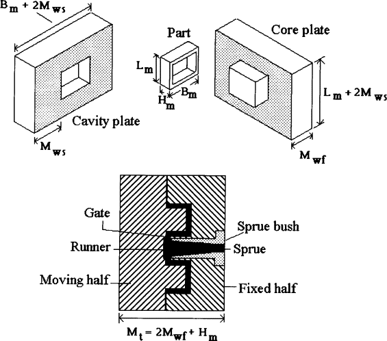
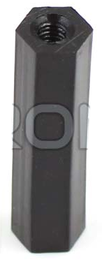

# PIMM_Design
From Design to Production: A Deep Dive into Plastic Injection Molding Machine

# PRODUCTS
| Name | Site_Info | Market_Price| DIM | 3D_Stl | Image |Mold_size|
| --- | --- | --- |  --- | :---: | :---: |   |
| Name | Site_Info | MOQ| XYZ | 3D_Stl | Image ||
| Hex Spacer | [KTRON](https://www.ktron.in/product/m3-x-25mm-hex-spacer-threaded-female/) | 3.98(MOQ=5) | Thread Size: M3 Spacer Length: 25mm | not_yet |  ||

