3# PIMM_Design
From Design to Production: A Deep Dive into Plastic Injection Molding Machine

# PRODUCTS
| Name | Site_Info | Market_Price| DIM | <table border="0"><tr><td>3D_openscad</td></tr><tr><td>FreeCAD</td></tr></table> | Image |Mold_size|
| --- | --- | --- |  --- | :---: | :---: |:---:|
| Name | Site_Info | MOQ| XYZ | 3D_Stl | Image ||
| Hex Spacer | [KTRON](https://www.ktron.in/product/m3-x-25mm-hex-spacer-threaded-female/) | 3.98(MOQ=5) |<table border="0"><tr><td>Thread Size: M3</td></tr><tr><td>Spacer Length: 25mm</td></tr></table>| not_yet |  |   |
| Hex Spacer | [KTRON]() | 3.98(MOQ=5) |<table border="0"><tr><td>Thread Size: M3</td></tr><tr><td>Spacer Length: 20mm</td></tr></table>| not_yet | 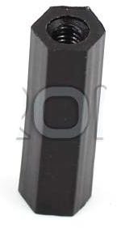 |   |
| Hex Spacer | [KTRON]() | 3.98(MOQ=5) |<table border="0"><tr><td>Thread Size: M3</td></tr><tr><td>Spacer Length: 15mm</td></tr></table>| not_yet | 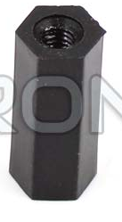 |   |
| Hex Spacer | [KTRON]() | 3.98(MOQ=5) |<table border="0"><tr><td>Thread Size: M3</td></tr><tr><td>Spacer Length: 12mm</td></tr></table>| not_yet | 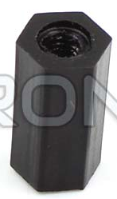 |   |
| Hex Spacer | [KTRON]() | 3.98(MOQ=5) |<table border="0"><tr><td>Thread Size: M3</td></tr><tr><td>Spacer Length: 10mm</td></tr></table>| not_yet | 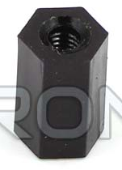 |   |
| --- | --- | --- |  --- | :---: | :---: |:---:|
| LED Spacer | [KTRON](https://www.ktron.in/product/3mm-led-spacer-height-2mm/) | 0.59(MOQ=30) |<table border="0"><tr><td>LED Size: 3mm</td></tr><tr><td>Spacer Height: 2mm</td></tr></table>| not_yet | 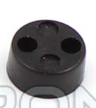 |   |
| LED Spacer | [KTRON]() | 0.63(MOQ=30) |<table border="0"><tr><td>LED Size: 3mm</td></tr><tr><td>Spacer Height: 3mm</td></tr></table>| not_yet | 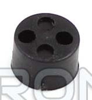 |   |
| LED Spacer | [KTRON]() | 0.66(MOQ=30) |<table border="0"><tr><td>LED Size: 4mm</td></tr><tr><td>Spacer Height: 3mm</td></tr></table>| not_yet | 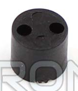 |   |
| LED Spacer | [KTRON]() | 0.68(MOQ=30) |<table border="0"><tr><td>LED Size: 5mm</td></tr><tr><td>Spacer Height: 3mm</td></tr></table>| not_yet | 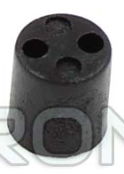 |   |
| LED Spacer | [KTRON]() | 0.70(MOQ=30) |<table border="0"><tr><td>LED Size: 6mm</td></tr><tr><td>Spacer Height: 3mm</td></tr></table>| not_yet | 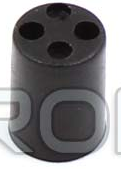 |   |
| LED Spacer | [KTRON]() | 0.78(MOQ=30) |<table border="0"><tr><td>LED Size: 8mm</td></tr><tr><td>Spacer Height: 3mm</td></tr></table>| not_yet | 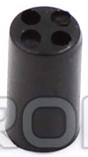 |   |
| LED Spacer | [KTRON]() | 0.82(MOQ=30) |<table border="0"><tr><td>LED Size: 10mm</td></tr><tr><td>Spacer Height: 3mm</td></tr></table>| not_yet | 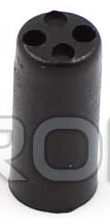 |   |
| LED Spacer | [KTRON]() | 0.93(MOQ=30) |<table border="0"><tr><td>LED Size: 12mm</td></tr><tr><td>Spacer Height: 3mm</td></tr></table>| not_yet | 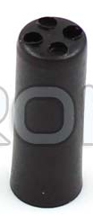 |   |
| LED Spacer | [KTRON]() | 1.10(MOQ=30) |<table border="0"><tr><td>LED Size: 15mm</td></tr><tr><td>Spacer Height: 3mm</td></tr></table>| not_yet | 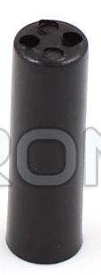 |   |
| LED Spacer | [KTRON]() | 1.25(MOQ=30) |<table border="0"><tr><td>LED Size: 20mm</td></tr><tr><td>Spacer Height: 3mm</td></tr></table>| not_yet | 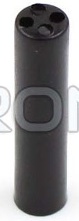 |   |
| --- | --- | --- |  --- | :---: | :---: |:---:|
| Round_Bush | [KTRON](https://www.ktron.in/product/pcb-round-bush-10x3x10mm/) | 2(MOQ=10) |<table border="0"><tr><td>Outer Diameter: 10mm</td></tr><tr><td>Inner Diameter: 3mm</td></tr><tr><td>Height: 10mm</td></tr></table>| not_yet | 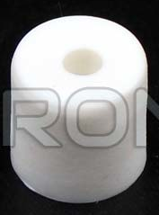 |   |
| Round_Bush | [KTRON](https://www.ktron.in/product/pcb-round-bush-10x3x10mm/) | 2(MOQ=10) |<table border="0"><tr><td>Outer Diameter: 10mm</td></tr><tr><td>Inner Diameter: 4mm</td></tr><tr><td>Height: 10mm</td></tr></table>| not_yet | 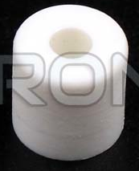 |   |
| Round_Bush | [KTRON](https://www.ktron.in/product/pcb-round-bush-10x3x10mm/) | 2(MOQ=10) |<table border="0"><tr><td>Outer Diameter: 10mm</td></tr><tr><td>Inner Diameter: 6mm</td></tr><tr><td>Height: 12mm</td></tr></table>| not_yet | 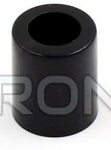 |   |
| Round_Bush | [KTRON](https://www.ktron.in/product/pcb-round-bush-10x3x10mm/) | 1.70(MOQ=10) |<table border="0"><tr><td>Outer Diameter: 12mm</td></tr><tr><td>Inner Diameter: 5mm</td></tr><tr><td>Height: 6mm</td></tr></table>| not_yet | 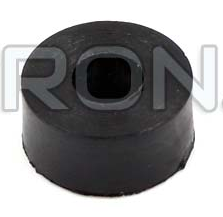 |   |
| --- | --- | --- |  --- | :---: | :---: |:---:|
| Round_Bush | [KTRON](https://www.ktron.in/product/pcb-round-bush-10x3x10mm/) | 2(MOQ=10) |<table border="0"><tr><td>Made of Nylon 66 Natural UL 94 – V2 material.</td></tr><tr><td> Requires a minimum 4mm hole diameter in the PCB.</td></tr> <tr><td>Designed for PCB thickness of 1.6mm.</td></tr><tr><td>    Chassis hole diameter should be 5.4mm. Compatible with chassis thickness of 1.2-1.4mm. Snap-Fit type.</td></table>| not_yet | 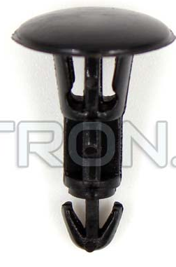 |   |

